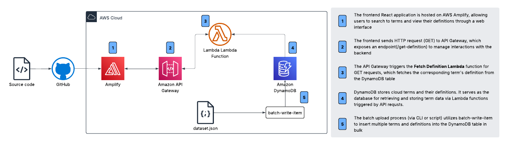
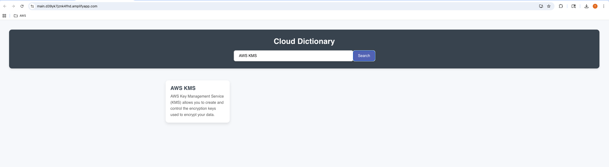

# Serverless Cloud Dictionary

## 🌟 Overview
In this project, we'll be developing a serverless cloud dictionary application where users can:

Search for terms related to cloud technologies.
View the definitions of cloud terms.
Utilize a serverless architecture using AWS services.
The application will use Lambda for backend processing, API Gateway for managing the API endpoints, and DynamoDB for storing the dictionary terms and their definitions.

The frontend, a React application, will be hosted on AWS Amplify, and API requests will be made to interact with the database.

## 🛠️ Services Used
* **AWS Amplify**: Host the frontend React application. **[Frontend Hosting]**
* **AWS Lambda**: Handle API requests for retrieving terms and adding new ones. **[Backend Processing]**
* **AWS API Gateway**: Manage API endpoints to allow communication between frontend and Lambda functions. **[API Management]**
* **AWS DynamoDB**: Store dictionary terms and definitions. **[Data Storage]**
* **IAM Roles & Policies**: Secure access to AWS resources like Lambda, DynamoDB, and API Gateway. **[Permissions]**

## ☁️ AWS Architecture

## &rarr; Final Result
